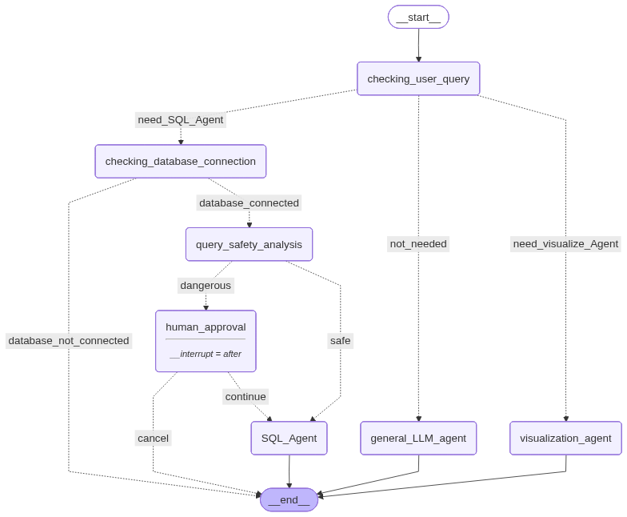

# SQL Agent — Intelligent AI SQL Data Analyst with Human-in-the-Loop & Visualization

## 💡 Overview
**SQL Agent** is a **full-stack, production-ready agentic AI application** that lets you query any database in plain English. It writes and executes SQL autonomously, visualizes results as charts, and protects your data with a **human-in-the-loop approval gate** — all orchestrated by a **LangGraph multi-agent graph**.

Built with **LangChain**, **LangGraph**, **Gemma4:26b (Ollama Cloud Model)**, **FastAPI**, and deployed on **Render** via **Docker**.

🔗 **Live Demo:** [agentic-ai-workflow-sql-agent.onrender.com](https://agentic-ai-workflow-sql-agent.onrender.com)

> 🔐 **Try it live using any Login credentials** — use any of these test accounts:

| Username | Password |
|---|---|
| akshat | akshat123 |
| storm | storm123 |
| akshatxstorm | storm@123 |

 ---
## 🧠 How It Works — The Agent Graph
 
Every user message flows through a stateful LangGraph graph. The router decides which agent handles it, and the graph enforces safety, human approval, and execution order automatically.
  

 
---
## ⚙️ Features
 
### 🧭 1. Intelligent Query Router
Every message is classified by an LLM using a **Pydantic Output Parser** into one of three routes:
- `need_sql_agent` → database query path
- `need_visualize_agent` → chart generation from prior results
- `no_need_of_sql_agent_and_visualize_agent` → general LLM + web search
The router uses the last 6 messages of conversation history to understand **intent**, not just keywords.
 
---

### 🗄️ 2. Multi-Database Support with User Isolation
- Supports **SQLite, PostgreSQL, MySQL** via connection URI.
- Each user gets their own **isolated database copy** — no data leaks between users.
- Validates the connection before routing any query, returns a clear error if disconnected.
- The file is stored server-side in a per-user directory on Render's persistent disk.
---

### 🛡️ 3. SQL Safety Analyzer
Every SQL-bound query is classified as `safe` or `dangerous` before execution:
- **Safe** (SELECT, read-only) → executes immediately.
- **Dangerous** (DELETE, UPDATE, DROP, INSERT) → routed to human approval.
Uses a dedicated Pydantic-structured LLM classification step — no regex, no keyword matching.
 
---

### 🧍 4. Human-in-the-Loop Approval (LangGraph Interrupt)
When a destructive query is detected:
1. LangGraph **pauses** the graph at `human_approval` using `interrupt_after`.
2. A polite, context-aware confirmation message is generated by the LLM.
3. The UI displays an approval modal — **Yes** resumes the graph, **No** cancels cleanly.
4. The `/resume` endpoint handles state restoration via `aupdate_state`.
This is real stateful interruption — not a UI trick. The graph literally pauses mid-execution.
 
---

### 🤖 5. Autonomous SQL Execution Agent (ReAct)
A **LangGraph ReAct agent** powered by the `SQLDatabaseToolkit`:
 
| Step | Tool Used |
|---|---|
| 1. List all tables | `sql_db_list_tables` |
| 2. Inspect schema | `sql_db_schema` |
| 3. Build query | LLM reasoning |
| 4. Validate syntax | `sql_db_query_checker` |
| 5. Execute | `sql_db_query` |
| 6. Return result + visualization hint | LLM |

 
---

### 📊 6. Data Visualization Agent
When the user requests a chart (or the SQL Agent suggests one):
- A **PythonREPL ReAct agent** writes Matplotlib code, executes it, and saves the plot.
- Automatically selects the best chart type (Bar, Line, Pie, etc.) based on data shape.
- Plots are stored **per-user** with UUID filenames to prevent collisions.
- The image path is embedded in the `AIMessage` using `[IMG]...[/IMG]` tags so it **persists in chat history** across sessions.

---

### 💬 7. General Conversational Agent
For non-database queries, a ReAct agent with **Tavily web search** handles:
- General knowledge questions
- Current events (live search)
- Questions about the application itself
The agent is context-aware — it knows it's part of a multi-agent SQL system.
 
---

### 🔐 8. JWT Authentication & User Isolation
- Register/login with **bcrypt-hashed passwords** and **JWT tokens** (24h expiry).
- Every user has isolated: chat threads, database files, and plot directories.
- Token stored in `localStorage`, sent as `Authorization: Bearer` header on every request.

---

### 💾 9. Persistent Memory & Thread Management
- Uses **LangGraph's SQLite Checkpointer** for permanent conversation persistence.
- Maintains full context across sessions and multi-turn decisions.
- Users can **switch between past conversations** and **delete threads** from the sidebar.

---

### ⚡ 10. Real-Time Token Streaming
- Responses stream **token by token** via `astream_events` (LangGraph v1 event API).
- Live node execution indicators stream before the response: `⚙️ checking_user_query → ⚙️ SQL_Agent`
- Warning messages and image URLs are also streamed inline — no polling required.
  
---

## 🧱 Tech Stack
 
| Layer | Technology |
|---|---|
| **Agent Framework** | LangGraph + LangChain |
| **Monitoring Framework** | LangSmith |
| **LLM** | gpt-oss:120b-cloud via ollama Cloud Models API |
| **Agent Pattern** | ReAct (via `create_react_agent`) |
| **Output Parsing** | Pydantic Output Parsers |
| **Backend** | FastAPI + Uvicorn |
| **Frontend** | HTML / CSS / Vanilla JavaScript |
| **Database (app)** | SQLite (via SQLAlchemy + aiosqlite) |
| **Memory** | LangGraph `AsyncSQLiteSaver` |
| **Auth** | JWT (`python-jose`) + `passlib` + `bcrypt` |
| **SQL Execution** | LangChain `SQLDatabaseToolkit` |
| **Visualization** | Matplotlib + Pandas + `PythonREPLTool` |
| **Web Search** | Tavily Search API |
| **Deployment** | Docker + Render (persistent disk) |
 
---

## 🚀 Demo
https://github.com/user-attachments/assets/de25d2fb-8353-4119-ba06-1ed6fb204205

---

## 🛠️ Local Setup
 
### 1. Clone the repo
 
```bash
git clone https://github.com/Akshat8388/Agentic_AI-Workflow-SQL_Agent.git
cd Agentic_AI-Workflow-SQL_Agent
```
 
### 2. Install dependencies

```bash
pip install -r requirements.txt
```

> **Note:** If you face any LangGraph dependency conflicts, install these versions explicitly:
> ```bash
> pip install langgraph==0.6.10 langgraph-checkpoint==4.0.1 langgraph-prebuilt==0.6.5 langgraph-checkpoint-sqlite==3.0.3

### 3. Create a `.env` file
 
```env
OLLAMA_API_KEY=your_ollama_api_key
SECRET_KEY=your_jwt_secret_key
TAVILY_API_KEY=your_tavily_api_key
LANGCHAIN_API_KEY=your_langchain_api_key
LANGCHAIN_TRACING_V2=true
LANGCHAIN_PROJECT=sql-agent
```
 
### 4. Run the app
 
```bash
cd backend
uvicorn main:app --reload
```
 
Open [http://localhost:8000](http://localhost:8000)
 
---
 
## 🐳 Run with Docker
 
```bash
# Build
docker build -t sql-agent .
 
# Run
docker run -p 8000:8000 \
  -e OLLAMA_API_KEY=your_token \
  -e SECRET_KEY=your_secret \
  -e TAVILY_API_KEY=your_key \
  -e LANGCHAIN_API_KEY=your_key \
  sql-agent
```
 
---

## 🙌 Author
 
Built by **Akshat** 🎉 — [https://github.com/Akshat8388](https://github.com/Akshat8388) 
